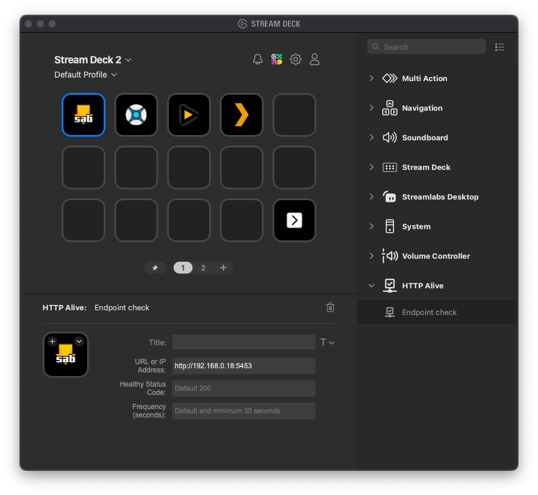

# Stream Deck HTTP ALIVE Plugin

Continuously check if a HTTP server is alive and be alerted if it goes down.

Press the key to open the URL in your default browser.

Demo video:

https://github.com/user-attachments/assets/c4368b86-7173-4873-af05-87b0caabe172

